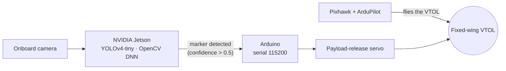
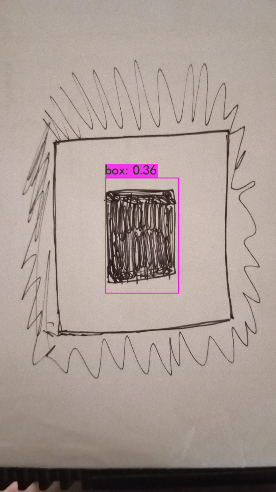

# Fixed-Wing VTOL UAV: Teknofest 2023

**Onboard vision and payload-release software for NUST AirWorks' fixed-wing VTOL UAV at TEKNOFEST 2023. The aircraft flies a search-and-rescue mission: it finds the target marker with a YOLOv4-tiny detector running on an NVIDIA Jetson and drops a payload on it.**

🏆 **Performance Award, TEKNOFEST 2023: 50,000 TL**

[](https://github.com/AlexeyAB/darknet)
[](https://opencv.org/)
[](https://developer.nvidia.com/embedded-computing)
[](https://ardupilot.org/)

NUST AirWorks · National University of Sciences and Technology (NUST), Pakistan · 2023

---

## Overview

A **fixed-wing VTOL** (vertical take-off and landing) aircraft takes off and lands like a multicopter but cruises on its wings like a plane. That gives it the endurance of a fixed-wing with the ability to operate without a runway.

For the TEKNOFEST 2023 mission, the UAV had to:
1. **Search** the area for a ground marker.
2. **Detect** the marker in real time from the onboard camera.
3. **Drop a payload** onto it.

The **Pixhawk** flight controller running **ArduPilot** flew the aircraft. An **NVIDIA Jetson** companion computer ran the vision pipeline in this repository. When it detected the marker, it told an **Arduino** to actuate the payload-release servo.



---

## Marker Detection

The detector is **YOLOv4-tiny**, trained on custom marker images with [Darknet](https://github.com/AlexeyAB/darknet) (input 416 × 416). On the aircraft it runs through **OpenCV's DNN module**, so the Darknet binary isn't needed at runtime.

<div align="center">
  
  <br><em>Bench test of the detector on a hand-drawn marker (class <code>box</code>, confidence 0.36).</em>
</div>

---

## Repository Structure

This repository is a copy of [AlexeyAB/darknet](https://github.com/AlexeyAB/darknet), used to train and test the detector, with the mission scripts added at the top level:

| File | Purpose |
|---|---|
| **`vtol_script_narmyn_2.py`** | **Mission script**: webcam → YOLOv4-tiny (OpenCV DNN) → draw detections → on a detection above 0.5 confidence, send `S` over serial (`/dev/ttyUSB0`, 115200 baud) to release the payload |
| `vtol_servo.py` | Stand-alone test: repeatedly sends `S` to the Arduino |
| `test_servo.py` | Toggles Jetson GPIO pin 18 (BCM; header pin 12) to test a servo signal line |
| `vtol_script_narmyn.py` | Earlier live-detection script (OpenCV DNN; classes `box`, `no_box`) |
| `vtol_script.py` | Earlier detection script with input/output video arguments |
| `vtol.py`, `vtol_narmeen.py` | Run the Darknet CLI detector on a single image (`./darknet detector test …`) |
| `CompiledMain.py`, `CompiledClass.py` | Extended target pipeline: detection → crop → dominant-colour estimate → CNN letter classification → JSON log |
| `video_yolov3.sh`, `video_yolov4.sh` | Darknet video-demo helpers |
| `predictions.jpg`, `video.avi`, `results/` | Sample detector outputs |
| `src/`, `include/`, `scripts/`, `3rdparty/`, `cmake/`, `Makefile`, `CMakeLists.txt`, `darknet*.py`… | Darknet framework (unchanged) |

---

## Setup

### 1. Model files

The trained model is **not** in this repository. Place these files as shown:

```
cfg/yolov4-tiny-custom.cfg            # network definition
cfg/yolov4-tiny-custom_best.weights   # trained weights
cfg/obj.data                          # Darknet data file (for the Darknet CLI scripts)
data/obj.names                        # class names, one per line: box, no_box
```

To train your own, follow AlexeyAB's [guide to training a custom detector](https://github.com/AlexeyAB/darknet#how-to-train-to-detect-your-custom-objects) with `yolov4-tiny-custom.cfg`.

### 2. Dependencies (on the Jetson)

```bash
pip install opencv-python numpy pyserial
# optional, for CompiledMain.py:  pip install imutils tensorflow scipy
```

To use the Darknet CLI scripts (`vtol.py`, `vtol_narmeen.py`), build Darknet first: `make` (set `GPU=1 CUDNN=1 OPENCV=1` in the `Makefile` on the Jetson).

### 3. Payload release

Program the Arduino to read serial at **115200 baud** and move the release servo when it receives the character **`S`**. Connect it to the Jetson; the script expects `/dev/ttyUSB0`. Test the link with:

```bash
python3 vtol_servo.py
```

### 4. Run the mission script

```bash
python3 vtol_script_narmyn_2.py      # press q to quit
```

---

## Known Issues

- **The payload loop never returns.** `actuateServo()` sends `S` in an endless `while True` loop. After the first detection, the vision loop stops and the servo is commanded continuously. Send `S` once instead.
- **Labels and colours use the wrong index.** In the drawing step, `classes[i]` and `colors[i]` index by the YOLO output layer, not the detected class. The script also uses the objectness score (`detections[i][j][4]`) rather than the class score as "confidence".
- **OpenCV version.** `net.getUnconnectedOutLayers()` returns a flat array in OpenCV ≥ 4.5.4, so `i[0] - 1` fails there. Use `net.getUnconnectedOutLayersNames()`.
- **`CompiledMain.py` doesn't run as committed.** `dir_video` is commented out, and `Compiled()` is called with four arguments while its constructor takes three. It also refers to a classifier model and output folders from a development machine.
- **Missing files:** the model files (see Setup) and the Arduino payload sketch are not included.

---

## Team

Developed by the **NUST AirWorks** team, National University of Sciences and Technology (NUST), Pakistan, for **TEKNOFEST 2023**, where the team won the **Performance Award (50,000 TL)**.

---

## Acknowledgements and Licence

- **[Darknet / YOLOv4](https://github.com/AlexeyAB/darknet)** by Alexey Bochkovskiy, based on Joseph Redmon's original [Darknet](https://pjreddie.com/darknet/). The framework code in this repository is Darknet's and is released under the YOLO licence (public domain; see [`LICENSE`](LICENSE)).
- **[ArduPilot](https://ardupilot.org/)** and **[Pixhawk](https://pixhawk.org/)** for flight control.
- **[TEKNOFEST](https://www.teknofest.org/)**, the aerospace and technology festival of Türkiye.
